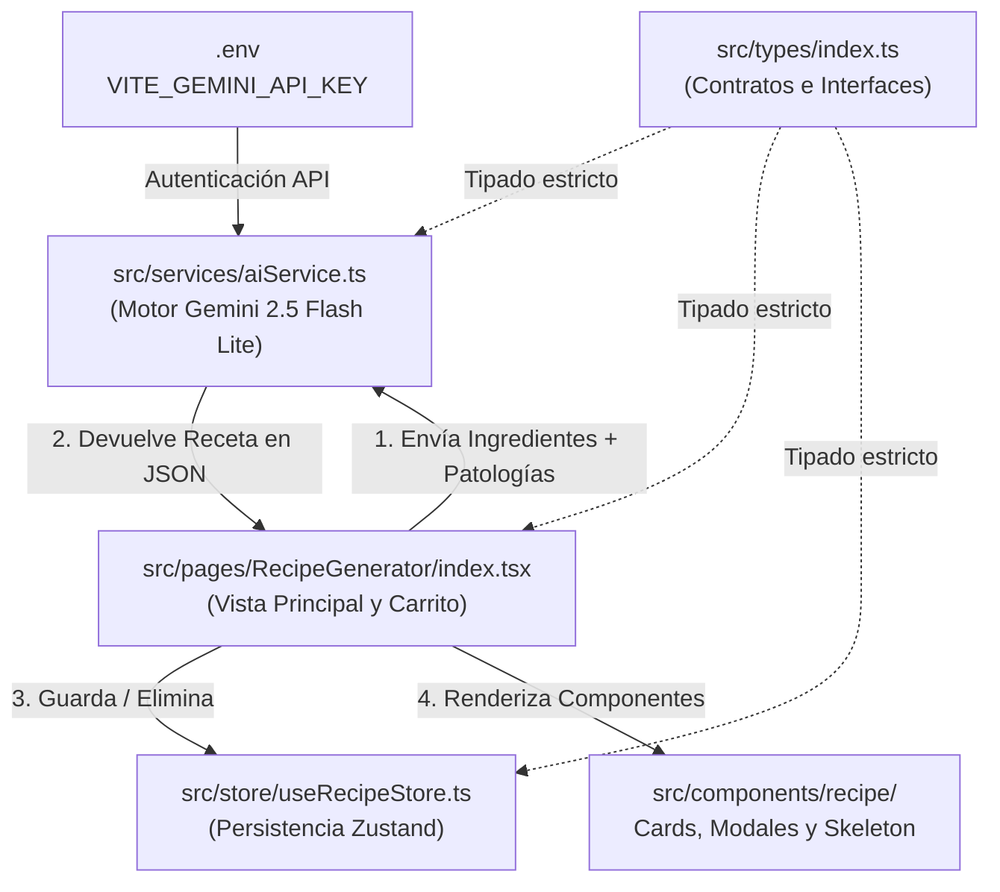

# 🤖 Arquitectura y Módulo de Inteligencia Artificial para la Generación de Recetas en ClemenciaApp

> [!NOTE]
> Este documento detalla la estructura de archivos, módulos y flujo de datos que hacen posible la creación, gestión y visualización de recetas clínicas adaptadas utilizando el modelo **Google Gemini 2.5 Flash Lite**.

---

## 📊 Diagrama de Flujo y Arquitectura

El siguiente diagrama muestra la relación entre los módulos del sistema y cómo viajan los datos durante el ciclo de vida de una receta generada por IA:

---

## 🗂️ Detalle de Archivos por Módulo

En total intervienen **7 archivos principales** distribuidos en **5 módulos lógicos**, diseñados bajo principios de separación de responsabilidades:

### 1. 🧠 Módulo de Servicios (Motor de Inteligencia Artificial)
*   **Archivo:** [aiService.ts](file:///c:/Users/PC-ANDRES/Proyectos/clemenciaapp/src/services/aiService.ts)
*   **Responsabilidad:** Gestiona la comunicación directa con la API de Google Gemini utilizando el SDK oficial `@google/genai`.
*   **Detalles sobre el uso de IA:**
    *   **Modelo utilizado:** `gemini-2.5-flash` (configurado para rendimiento ultra rápido y precisión clínica).
    *   **Búsqueda web activa:** Configurado con `tools: [{ googleSearch: {} }]` para acceder a datos nutricionales actualizados si es necesario.
    *   **Parámetros de generación:**
        *   `temperature: 1` (para variedad gastronómica dentro de los límites médicos).
        *   `maxOutputTokens: 8192` (permite procedimientos detallados).
        *   `topP: 0.95`.
    *   **Ingeniería de Prompt:** El servicio inyecta los ingredientes del inventario y las restricciones clínicas (ej. *Diabetes*, *Hipertensión*, *Renal*) con la instrucción estricta de retornar **únicamente código JSON** sin saludos ni prefijos conversacionales, calculando porciones, calorías y proteínas por ración.

---

### 2. 🖥️ Módulo de Páginas / Vista Principal (Controlador UI)
*   **Archivo:** [index.tsx](file:///c:/Users/PC-ANDRES/Proyectos/clemenciaapp/src/pages/RecipeGenerator/index.tsx)
*   **Responsabilidad:** Es la interfaz principal donde el usuario o nutricionista opera el sistema.
*   **Funcionalidad:**
    *   **Gestión de Vistas:** Alterna entre el **Recetario General** (grid con filtros de búsqueda y origen) y la vista del **Generador IA**.
    *   **Carrito de Ingredientes:** Permite al usuario seleccionar alimentos en stock desde `useInventoryStore` o agregar ingredientes personalizados con su valor nutricional.
    *   **Selección de Patologías:** Permite marcar múltiples condiciones clínicas para restringir la receta.
    *   **Invocación:** Al presionar *"Generar Menú Nutricional"*, activa el indicador de carga y ejecuta `generarRecetaIA()`.

---

### 3. 💾 Módulo de Estado / Almacenamiento (Persistencia)
*   **Archivo:** [useRecipeStore.ts](file:///c:/Users/PC-ANDRES/Proyectos/clemenciaapp/src/store/useRecipeStore.ts)
*   **Responsabilidad:** Almacén global desarrollado con **Zustand** y el middleware `persist`.
*   **Funcionalidad:**
    *   Mantiene el listado `generatedRecipes` en el almacenamiento local del navegador (`localStorage` bajo la llave `generated-recipes-storage`).
    *   Expone los métodos `addGeneratedRecipe(recipe)` para guardar creaciones de la IA y `removeGeneratedRecipe(id)` para borrarlas del recetario.

---

### 4. 🎨 Módulo de Componentes Visuales (Presentación de Recetas)
Ubicados en la carpeta `src/components/recipe/`, estos componentes desacoplan la presentación visual de la lógica de negocio:

| Archivo | Descripción y Función |
| :--- | :--- |
| **[RecipeCard.tsx](file:///c:/Users/PC-ANDRES/Proyectos/clemenciaapp/src/components/recipe/RecipeCard.tsx)** | Tarjeta visual para el grid del recetario. Muestra etiquetas de macros, calorías y un **distintivo visual IA ✨** si la receta fue creada algorítmicamente en lugar de ser una receta base. |
| **[RecipeDetailView.tsx](file:///c:/Users/PC-ANDRES/Proyectos/clemenciaapp/src/components/recipe/RecipeDetailView.tsx)** | Modal a pantalla completa. Muestra los ingredientes con sus cantidades, el procedimiento paso a paso, adecuación clínica y botones para *"Guardar en Recetario"* o *"Regenerar"*. |
| **[RecipeSkeletonLoader.tsx](file:///c:/Users/PC-ANDRES/Proyectos/clemenciaapp/src/components/recipe/RecipeSkeletonLoader.tsx)** | Componente de carga (*skeleton*) que se muestra en la interfaz mientras se espera la respuesta asíncrona del modelo Gemini. |

---

### 5. 📐 Módulo de Tipología (Contratos de Datos)
*   **Archivo:** [index.ts](file:///c:/Users/PC-ANDRES/Proyectos/clemenciaapp/src/types/index.ts)
*   **Responsabilidad:** Define las estructuras y tipos estrictos de TypeScript que garantizan la integridad de los datos en toda la aplicación.
*   **Tipos clave:**
    *   `Receta`: Estructura completa (id, título, ingredientes, procedimiento, calorías, proteínas, aptoPara).
    *   `CondicionClinica`: Tipo unión con las patologías soportadas (`'Diabetes' | 'Hipertensión' | 'Enfermedad Renal'`, etc.).
    *   `IngredienteReceta`: Detalle de cantidad y unidad para cada ítem.

---

### 📎 Archivos Complementarios y de Soporte
*   **[recipes.json](file:///c:/Users/PC-ANDRES/Proyectos/clemenciaapp/src/data/recipes.json):** Base de datos predeterminada con "Recetas de la Fundación". En la vista del recetario se fusionan con las recetas IA para presentar un catálogo unificado.
*   **[.env](file:///c:/Users/PC-ANDRES/Proyectos/clemenciaapp/.env):** Contiene la clave privada `VITE_GEMINI_API_KEY` requerida por `@google/genai` para autenticar las peticiones.

---

## 🚀 Flujo de Ejecución Paso a Paso

1. **Preparación:** El usuario entra al *Generador IA*, marca las patologías del paciente y añade ingredientes al carrito.
2. **Petición:** Al confirmar, `RecipeGenerator` llama a `generarRecetaIA(params)`.
3. **Procesamiento IA:** `aiService` construye el prompt médico/culinario y consulta a **Gemini 2.5 Flash Lite** con Google Search activado.
4. **Parseo y Validación:** El texto devuelto se limpia de etiquetas Markdown, se valida y convierte en un objeto TypeScript tipado (`Receta`).
5. **Visualización y Guardado:** El modal `RecipeDetailView` muestra el menú generado. Si el usuario aprueba la propuesta, se llama a `addGeneratedRecipe()`, persistiendo la receta en Zustand y mostrándola en el recetario principal junto a las recetas de la fundación.
